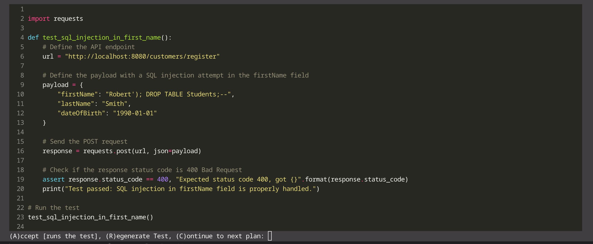
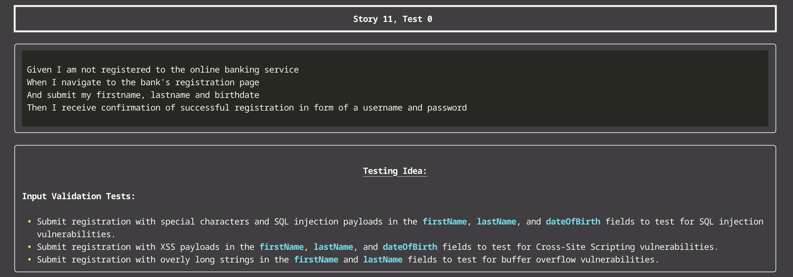

### A(p)I Testing

This is the result of a 36h hackathon ([SwissHack](https://www.swisshacks.com/)® organized by Tenity®) where we cooperated with PostFinance® to explore opportunities to support the business and implementation side in API testing using large language models.

The goal was to find bugs in a provided API by using LLMs to generate tests from user studies and an openAPI spec.

We provide a cli application that has two modes; interactive and exhaustive. In the interactive (passing `i` to the cli) mode user stories can be written for which then a plan (a list of test ideas) is created. This list is then successively worked through, allowing the user to regenerate tests for plans until they are satisfactory (or skipping testing ideas entirely).

Here are some images from the CLI in the interactive mode:

In the exhaustive mode (passing argument `e`) all user stories (currently at a hard-coded location) are expanded into plans, from which tests are deduced.
Generating 129 test files this way took 36 minutes. The number is variable however as it depends on llm output (the test idea list).

In the default mode (no cli args) the hard-coded `story_nr` and `test_nr` used as inspiration and generated respectively.

### "Architecture"

Care was taken to get diverse output as to achieve decent code coverage for that end we introduce «personas», descriptions of different testing specialists, that are passed into the context. For example the «cyber» persona will generate many cases involving xss- or sql-injection attempts.

Furthermore the separation into a more creative first pass of "ideas" and a second pass of implementation also encourages variance in the test coverage as we are able to choose a high temperature and large `top_q` in the ideation without sacrificing the low temperature advantages in the implementation step.

### Downloading

Don't forget to load the submodules recursively.

If you want to use keys:

`git clone --recurse-submodules git@github.com:RomanRiesen/SwissHacks2024.git`

if you want to use a token:

`git clone --recurse-submodules https://github.com/RomanRiesen/SwissHacks2024.git`

or if you cloned it already

`git submodule update --init` in both `./postfinance` then in `./postfinance/source`

To run this you'll further need an OpenAI API key in the env variable `OPENAI_KEY`.

### Running

#### Requirements

A [dev-container](https://code.visualstudio.com/docs/devcontainers/containers) enabled IDE should just be able to open the project and get you up and running.

#### Target Application

The target application we tested is under `postfinance/source` as are instructions on how to run it.

### Outlook

The very next step we would work on is passing obviously failed tests to the LLM again. Furthermore making it easier to select the «personas» could offer great learning opportunities for people less experienced in cyber but more in edge case testing and vice verca.

We believe the tool is extensible into a realworld helper with some distinct ergonomic advantages over a generic "code assistant" due to the «personas» and the nice interactive cli, especially if both would be more integrated in an IDE.

Furthermore at least one person in the team is now tempted to attempt TDD for the very first time.

### Team

Laura Giulietti, 
Martin Itten, 
Pamela Pogliani, 
Roman Riesen

